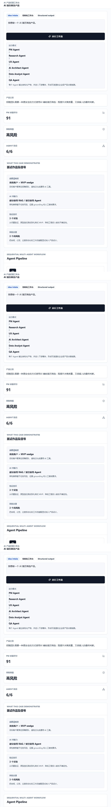
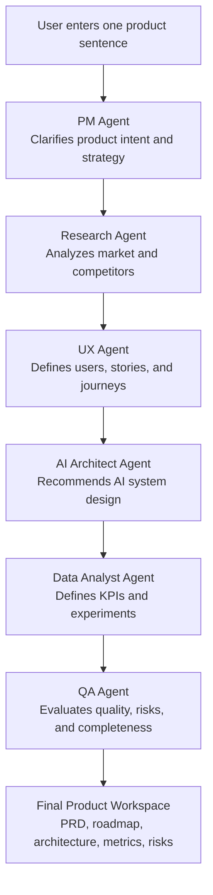
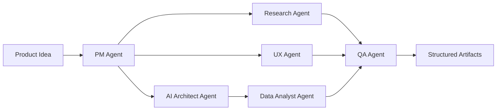
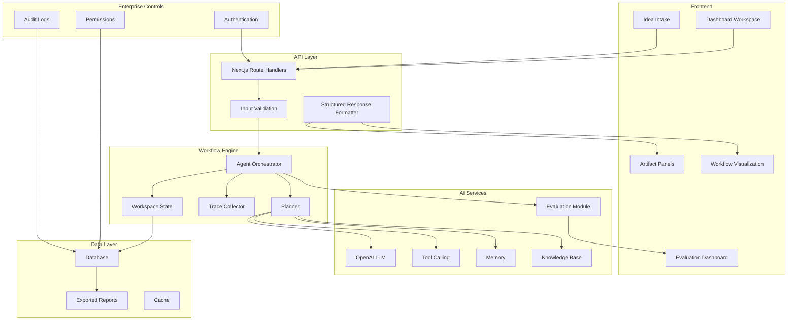
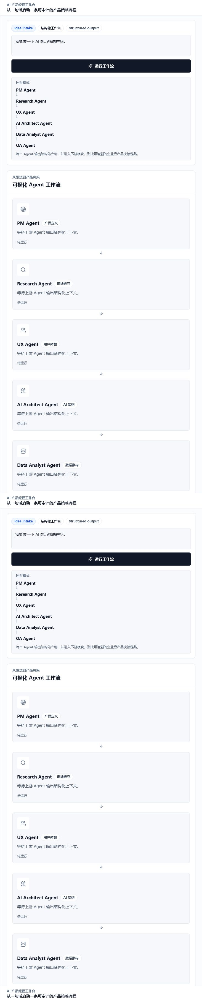

# PM Studio AI

> AI Product Manager Copilot for turning a one-line product idea into a structured product strategy workspace.

PM Studio AI is an AI-native product management workspace that helps teams clarify ambiguous product ideas, orchestrate specialist AI agents, and produce decision-ready artifacts for strategy, planning, architecture, evaluation, and execution.



<p align="left">
  <a href="#"></a>
  <a href="#"></a>
  <a href="#"></a>
  <a href="#"></a>
  <a href="#"></a>
  <a href="#"></a>
  <a href="#"></a>
</p>

| Resource | Link |
| --- | --- |
| Product Demo | `http://localhost:3008` |
| Product Requirements | [docs/PRD.md](docs/PRD.md) |
| User Research | [docs/User Research.md](docs/User%20Research.md) |
| Competitive Analysis | [docs/Competitive Analysis.md](docs/Competitive%20Analysis.md) |
| AI Architecture | [docs/AI Architecture.md](docs/AI%20Architecture.md) |
| Evaluation Plan | [docs/Evaluation.md](docs/Evaluation.md) |
| Product Roadmap | [docs/Roadmap.md](docs/Roadmap.md) |
| Portfolio Case Study | [portfolio/PM_Studio_AI_Case_Study.pdf](portfolio/PM_Studio_AI_Case_Study.pdf) |

---

## Contents

- [Product Overview](#product-overview)
- [Key Features](#key-features)
- [Product Workflow](#product-workflow)
- [AI Multi-Agent Architecture](#ai-multi-agent-architecture)
- [System Architecture](#system-architecture)
- [Tech Stack](#tech-stack)
- [Product Screenshots](#product-screenshots)
- [Design Principles](#design-principles)
- [Evaluation](#evaluation)
- [Future Roadmap](#future-roadmap)
- [Repository Structure](#repository-structure)
- [Local Development](#local-development)
- [Product Philosophy](#product-philosophy)
- [License](#license)

---

## Product Overview

### The Problem

AI product managers often start with incomplete ideas.
A founder may say:

> I want to build an AI resume screening product.

That sentence contains a product category.
It does not yet contain a product strategy.
It does not define the buyer.
It does not define the end user.
It does not define the risk surface.
It does not clarify the workflow.
It does not identify the required data.
It does not state whether the product needs RAG.
It does not justify whether an agentic workflow is necessary.
It does not define evaluation.
It does not explain how success will be measured.
Most AI demos stop at response generation.
Real product work begins after the first response.
PM Studio AI exists for that gap.

### The Product

PM Studio AI transforms a single sentence into a complete product management workspace.
It interprets the product intent.
It clarifies requirements.
It identifies target users.
It generates user stories.
It drafts a structured PRD.
It maps competitors.
It designs a product workflow.
It recommends an AI architecture.
It decides whether RAG, agents, or structured prompting are appropriate.
It defines an MVP.
It proposes KPIs.
It creates experiment plans.
It generates a user journey.
It analyzes risk.
It evaluates the quality of the output.
The result is not a chat transcript.
The result is a product operating system.

### Why It Was Created

AI product management requires a different portfolio artifact from traditional software projects.
A coding project can show implementation skill.
A prompt demo can show familiarity with LLM APIs.
Neither is enough to demonstrate AI product judgment.
PM Studio AI was created to demonstrate the ability to design product workflows around AI capabilities.
It shows how an ambiguous business idea becomes a product plan.
It shows how multiple agents can collaborate without becoming a generic chat interface.
It shows how AI output can be structured, inspected, and evaluated.
It shows how product thinking, system design, and AI governance fit together.

### Why Existing AI Assistants Are Insufficient

General assistants are optimized for conversation.
Product teams need structured execution.
General assistants produce answers.
Product teams need artifacts.
General assistants rely on the user to maintain context.
Product teams need persistent workspaces.
General assistants rarely expose decision logic.
Product teams need traceability.
General assistants can draft documents.
Product teams need cross-functional alignment.
General assistants can brainstorm competitors.
Product teams need positioning, tradeoffs, and validation plans.
General assistants can generate a PRD.
Product teams need a workflow that connects PRD quality to metrics, experiments, architecture, and risk.
PM Studio AI is designed for that operating model.

### What Makes It Different

PM Studio AI is workflow-first.
It does not ask the user to chat with a blank prompt box.
It guides the product idea through specialist agents.
It treats each artifact as part of a decision chain.
It separates product strategy from market research.
It separates user experience from system architecture.
It separates data metrics from quality evaluation.
It makes risks visible before execution.
It turns AI from a writing assistant into a product planning partner.

### Product Positioning

| Dimension | PM Studio AI Position |
| --- | --- |
| Category | AI-native product management workspace |
| Primary User | AI Product Manager |
| Secondary Users | Founders, product leads, engineering managers, UX researchers |
| Core Job | Convert vague product intent into decision-ready product artifacts |
| Interface Model | Dashboard-based workspace |
| Intelligence Model | Multi-agent workflow orchestration |
| Output Model | Structured product documents, metrics, workflows, risks, and architecture recommendations |
| Differentiator | Product reasoning is decomposed into specialist agents and evaluated as a system |

### Product Promise

> Bring senior product judgment to the earliest stage of AI product creation.

PM Studio AI does not replace product managers.
It increases the quality, speed, and completeness of product thinking.
It helps a team move from idea to evidence.
It helps a team move from prompt to workflow.
It helps a team move from AI enthusiasm to measurable product value.

---

## Key Features

| Feature | Purpose | Business Value | Expected Output |
| --- | --- | --- | --- |
| Requirement Analysis | Convert ambiguous input into product context | Reduces discovery ambiguity and alignment cost | Product thesis, problem framing, assumptions, constraints |
| AI Product Planning | Translate opportunity into execution plan | Improves PM decision quality before engineering investment | Product strategy, goals, non-goals, MVP scope |
| PRD Generation | Produce a structured product requirement document | Accelerates cross-functional planning | Problem statement, personas, use cases, requirements, success metrics |
| User Story Generation | Define user-centered implementation units | Connects product strategy to delivery | User stories with role, goal, benefit, and acceptance criteria |
| Competitor Analysis | Map market alternatives and differentiation | Supports positioning and prioritization | Competitor categories, strengths, weaknesses, opportunities |
| Product Roadmap | Sequence product evolution | Creates a clear path from MVP to enterprise adoption | Versioned roadmap, themes, milestones, dependencies |
| AI Architecture Recommendation | Select the right AI pattern for the use case | Prevents over-engineering and unsafe AI design | RAG, agent, workflow, memory, guardrail, and evaluation recommendations |
| Workflow Design | Visualize the end-to-end product journey | Aligns PM, design, engineering, and GTM teams | Product workflow, user journey, operational handoffs |
| Evaluation Planning | Define how output quality will be measured | Makes AI quality measurable and governable | Quality metrics, test cases, experiments, thresholds |
| Export Reports | Package outputs for review and portfolio presentation | Turns workspace work into shareable decision artifacts | PRD, research brief, architecture memo, evaluation summary, case study |

### Feature Card: Requirement Analysis

| Attribute | Detail |
| --- | --- |
| Primary Agent | PM Agent |
| Input | One-line product idea |
| Output | Structured product context |
| User Value | Turns vague intent into a usable product brief |
| Business Value | Reduces the cost of early discovery |
| Product Risk Addressed | Misaligned problem definition |
| Quality Signal | Completeness of problem, audience, constraint, and goal extraction |

Requirement Analysis is the first product reasoning step.
The system reads the initial idea as a strategic input.
It identifies the domain.
It identifies the product type.
It infers target customers.
It surfaces unstated assumptions.
It separates what is known from what must be validated.
It creates a starting point that downstream agents can use consistently.
The feature is intentionally structured.
It does not produce a free-form essay.
It produces context that can drive workflow orchestration.

### Feature Card: AI Product Planning

| Attribute | Detail |
| --- | --- |
| Primary Agent | PM Agent |
| Input | Product context and inferred constraints |
| Output | Product thesis, MVP, goals, non-goals |
| User Value | Gives the user a senior PM starting point |
| Business Value | Helps teams avoid building the wrong product |
| Product Risk Addressed | Scope creep and weak prioritization |
| Quality Signal | Clarity of tradeoffs and MVP discipline |

AI Product Planning defines the product's strategic spine.
It answers why the product should exist.
It answers who the first user is.
It answers what should be built first.
It answers what should be excluded.
It makes tradeoffs explicit.
It creates the planning baseline for the PRD, roadmap, and evaluation plan.

### Feature Card: PRD Generation

| Attribute | Detail |
| --- | --- |
| Primary Agent | PM Agent |
| Input | Product thesis, personas, user stories, MVP |
| Output | Product Requirements Document |
| User Value | Produces a reviewable product artifact |
| Business Value | Accelerates alignment with engineering and design |
| Product Risk Addressed | Fragmented requirements |
| Quality Signal | Requirements are specific, testable, and tied to user value |

The PRD is treated as a decision document.
It includes the problem.
It includes the audience.
It includes user needs.
It includes product goals.
It includes non-goals.
It includes functional requirements.
It includes AI-specific requirements.
It includes success metrics.
It includes risks and open questions.
The PRD is not the end of the workflow.
It is one artifact inside a broader product operating model.

### Feature Card: User Story Generation

| Attribute | Detail |
| --- | --- |
| Primary Agent | UX Agent |
| Input | Personas, user journey, product context |
| Output | User stories and acceptance criteria |
| User Value | Converts strategy into user-centered execution |
| Business Value | Improves engineering handoff quality |
| Product Risk Addressed | Building features without user intent |
| Quality Signal | Stories are tied to real jobs, workflows, and success conditions |

User stories are generated from product context.
They are not generic agile filler.
Each story identifies a user role.
Each story identifies a goal.
Each story identifies the benefit.
Each story includes acceptance criteria.
Each story connects to the product workflow.
Each story supports implementation planning.

### Feature Card: Competitor Analysis

| Attribute | Detail |
| --- | --- |
| Primary Agent | Research Agent |
| Input | Product category, target segment, market assumptions |
| Output | Competitor map and differentiation opportunities |
| User Value | Shows where the product can win |
| Business Value | Improves positioning and GTM clarity |
| Product Risk Addressed | Undifferentiated product strategy |
| Quality Signal | Analysis includes categories, strengths, gaps, and defensible angles |

Competitor Analysis does not only list companies.
It maps alternatives.
It identifies direct competitors.
It identifies indirect competitors.
It identifies incumbent workflows.
It identifies substitute behaviors.
It identifies market gaps.
It proposes differentiation.
It connects differentiation to product decisions.

### Feature Card: Product Roadmap

| Attribute | Detail |
| --- | --- |
| Primary Agent | PM Agent |
| Input | MVP, risk, architecture, market opportunity |
| Output | Versioned product roadmap |
| User Value | Provides an execution path |
| Business Value | Aligns product ambition with delivery sequencing |
| Product Risk Addressed | Building advanced capabilities too early |
| Quality Signal | Roadmap shows clear evolution from MVP to enterprise readiness |

The roadmap is staged.
It starts with a focused MVP.
It expands into workflow depth.
It adds evaluation and governance.
It supports team collaboration.
It evolves toward enterprise adoption.
Each stage has a reason to exist.

### Feature Card: AI Architecture Recommendation

| Attribute | Detail |
| --- | --- |
| Primary Agent | AI Architect Agent |
| Input | Product workflow, risk level, data needs, output requirements |
| Output | AI architecture recommendation |
| User Value | Explains how AI should power the product |
| Business Value | Prevents fragile or overbuilt AI systems |
| Product Risk Addressed | Choosing agents, RAG, or fine-tuning without justification |
| Quality Signal | Architecture matches the actual product job |

The AI Architect Agent decides whether the product needs simple prompting.
It decides whether the product needs RAG.
It decides whether the product needs agents.
It decides whether human review is required.
It decides what data must be stored.
It decides where evaluation should happen.
It decides which risks require guardrails.
It explains the reasoning behind the recommendation.

### Feature Card: Workflow Design

| Attribute | Detail |
| --- | --- |
| Primary Agent | UX Agent |
| Input | User intent, product artifacts, agent outputs |
| Output | End-to-end workflow map |
| User Value | Makes the product understandable and actionable |
| Business Value | Improves cross-functional execution |
| Product Risk Addressed | Disconnected product features |
| Quality Signal | Workflow reflects real user decisions and operational steps |

Workflow Design gives the product a visual operating model.
It shows where the user starts.
It shows how agents contribute.
It shows where artifacts are generated.
It shows where quality checks occur.
It shows how the final report is assembled.
It makes the product feel like a workspace.

### Feature Card: Evaluation Planning

| Attribute | Detail |
| --- | --- |
| Primary Agent | Data Analyst Agent and QA Agent |
| Input | Product artifacts and expected quality dimensions |
| Output | Evaluation plan, metrics, quality thresholds |
| User Value | Makes AI quality observable |
| Business Value | Supports safer deployment and continuous improvement |
| Product Risk Addressed | Unmeasured hallucination and inconsistent output |
| Quality Signal | Metrics evaluate correctness, completeness, usefulness, and consistency |

Evaluation Planning is treated as a core feature.
The product defines quality before scaling.
It evaluates requirement completeness.
It evaluates PRD quality.
It evaluates workflow accuracy.
It evaluates planning consistency.
It evaluates architecture fit.
It evaluates risk coverage.
It evaluates user satisfaction.
It evaluates latency.

### Feature Card: Export Reports

| Attribute | Detail |
| --- | --- |
| Primary Agent | QA Agent |
| Input | Validated product workspace |
| Output | Shareable product strategy package |
| User Value | Converts product work into review-ready documentation |
| Business Value | Improves stakeholder communication |
| Product Risk Addressed | Losing insights across disconnected documents |
| Quality Signal | Reports are structured, complete, and traceable to source artifacts |

Export Reports turns workspace outputs into durable artifacts.
The portfolio package includes product documentation.
The case study explains product decisions.
The screenshots show the workspace.
The generated artifacts show the workflow.
The evaluation plan shows product maturity.
The report layer makes the product legible to recruiters, founders, and hiring managers.

---

## Product Workflow

The product workflow is designed around a single principle:

> The user should provide intent, while the system performs structured product reasoning.

The user does not need to know how to prompt each specialist.
The user does not need to manage context manually.
The user does not need to decide which artifact comes first.
The workflow performs that orchestration.



### Workflow Stage 1: Product Intent

| Stage | Product Intent |
| --- | --- |
| User Action | Enters one sentence |
| System Goal | Understand the product opportunity |
| Main Risk | The input is incomplete |
| System Response | Infer context while preserving assumptions |
| Output | Product brief |

The workflow begins with one sentence.
This is intentional.
AI product managers often receive ideas in raw form.
The first job is not to write a document.
The first job is to make the idea workable.
The product treats the sentence as an input signal.
It identifies category.
It identifies likely users.
It identifies market context.
It identifies risk level.
It identifies the type of AI capability implied.
It creates a structured context object for downstream agents.

### Workflow Stage 2: PM Agent

| Stage | PM Agent |
| --- | --- |
| System Goal | Convert intent into product strategy |
| Main Risk | Overbuilding before understanding the problem |
| System Response | Define thesis, goals, non-goals, MVP |
| Output | Product strategy baseline |

The PM Agent creates strategic structure.
It frames the problem.
It defines the target customer.
It proposes the product thesis.
It scopes the MVP.
It writes the PRD foundation.
It clarifies what should not be built yet.
It establishes the product logic that other agents inherit.

### Workflow Stage 3: Research Agent

| Stage | Research Agent |
| --- | --- |
| System Goal | Understand the market context |
| Main Risk | Building without positioning |
| System Response | Map competitors and alternatives |
| Output | Competitive analysis |

The Research Agent expands the external view.
It identifies competitor categories.
It recognizes indirect alternatives.
It surfaces differentiation opportunities.
It identifies adoption blockers.
It connects market findings back to product decisions.

### Workflow Stage 4: UX Agent

| Stage | UX Agent |
| --- | --- |
| System Goal | Translate product strategy into user experience |
| Main Risk | Producing features without user flow |
| System Response | Define personas, stories, and journeys |
| Output | UX planning artifacts |

The UX Agent brings the product closer to real usage.
It defines primary personas.
It identifies jobs to be done.
It writes user stories.
It maps the end-to-end journey.
It clarifies where users need trust, control, and visibility.

### Workflow Stage 5: AI Architect Agent

| Stage | AI Architect Agent |
| --- | --- |
| System Goal | Recommend the correct AI system pattern |
| Main Risk | Using RAG or agents because they sound impressive |
| System Response | Match architecture to product need |
| Output | AI architecture memo |

The AI Architect Agent evaluates the product from a systems perspective.
It decides whether workflow orchestration is enough.
It decides when retrieval is required.
It decides when tools are needed.
It decides when persistent memory is useful.
It decides when human review is necessary.
It defines guardrails.
It defines evaluation checkpoints.

### Workflow Stage 6: Data Analyst Agent

| Stage | Data Analyst Agent |
| --- | --- |
| System Goal | Make product value measurable |
| Main Risk | Launching without success criteria |
| System Response | Define KPIs, experiments, and quality metrics |
| Output | Measurement plan |

The Data Analyst Agent turns product ambition into measurable signals.
It defines product metrics.
It defines AI quality metrics.
It defines business metrics.
It proposes experiments.
It connects metrics to product decisions.

### Workflow Stage 7: QA Agent

| Stage | QA Agent |
| --- | --- |
| System Goal | Inspect the complete workspace |
| Main Risk | Shipping incomplete or inconsistent artifacts |
| System Response | Score quality and identify risks |
| Output | Evaluation summary |

The QA Agent acts as the final reviewer.
It checks artifact completeness.
It checks consistency across documents.
It checks risk coverage.
It checks whether the architecture fits the product.
It checks whether the MVP is focused.
It checks whether the output is decision-ready.

### Workflow Stage 8: Final Report

| Stage | Final Report |
| --- | --- |
| System Goal | Package outputs for review |
| Main Risk | Insights remain scattered |
| System Response | Present artifacts in a dashboard-based workspace |
| Output | Complete product strategy workspace |

The final workspace is designed for review.
It shows the product thesis.
It shows the generated PRD.
It shows personas.
It shows user stories.
It shows competitors.
It shows the product workflow.
It shows AI architecture.
It shows KPIs.
It shows experiments.
It shows risks.
It shows evaluation scores.
The output is structured enough to support an interview discussion.
It is also structured enough to support a real product review.

---

## AI Multi-Agent Architecture

PM Studio AI uses specialist agents because product management is not one task.
Product work is a chain of judgments.
Each judgment has a different context.
Each context requires a different lens.
The multi-agent architecture decomposes product thinking into distinct professional roles.



### Agent Operating Model

| Principle | Description |
| --- | --- |
| Specialist Responsibility | Each agent owns a specific product management dimension |
| Structured Input | Agents receive typed product context instead of raw chat history |
| Structured Output | Agents return artifacts that can be rendered, inspected, and evaluated |
| Traceable Reasoning | Each agent records objective, summary, and confidence |
| Sequential Orchestration | Outputs are ordered to preserve product logic |
| Evaluation Layer | Final outputs are inspected before being presented as a workspace |

### PM Agent

| Field | Description |
| --- | --- |
| Role | Product strategy lead |
| Responsibilities | Clarify product idea, define product thesis, write PRD foundation, scope MVP, define goals and non-goals |
| Inputs | One-line idea, inferred product category, target users, domain constraints |
| Outputs | Product context, product thesis, PRD, MVP recommendation, KPI baseline |
| Decision Logic | Prioritize clarity, user value, MVP discipline, and strategic tradeoffs |

#### PM Agent Responsibilities

The PM Agent is the first strategic interpreter.
It turns ambiguity into product structure.
It defines the problem space.
It identifies the target segment.
It clarifies why the product should exist.
It establishes the product thesis.
It sets goals.
It sets non-goals.
It defines MVP scope.
It drafts PRD sections.
It defines the first measurable outcomes.
It creates the baseline for every downstream agent.

#### PM Agent Inputs

The PM Agent receives the user's initial idea.
It receives inferred domain context.
It receives product category assumptions.
It receives target customer assumptions.
It receives constraints extracted from the idea.
It receives no hidden chat transcript dependency.
The inputs are structured so the agent can be tested.

#### PM Agent Outputs

The PM Agent outputs a product context object.
It outputs a product thesis.
It outputs a PRD skeleton.
It outputs goals.
It outputs non-goals.
It outputs MVP scope.
It outputs initial KPIs.
It outputs a trace that explains its objective and confidence.

#### PM Agent Decision Logic

The PM Agent favors narrow MVPs over broad roadmaps.
It favors explicit assumptions over false certainty.
It favors testable requirements over generic statements.
It favors user value over feature volume.
It favors product constraints over technical spectacle.
It makes the first decision boundary for the product.

### Research Agent

| Field | Description |
| --- | --- |
| Role | Market and competitive intelligence analyst |
| Responsibilities | Analyze market alternatives, competitor categories, positioning, adoption risks, and differentiation |
| Inputs | Product context, target users, domain, product thesis |
| Outputs | Competitor insights, market gaps, positioning recommendations |
| Decision Logic | Identify where the product can create defensible value |

#### Research Agent Responsibilities

The Research Agent prevents the product from existing in a vacuum.
It maps competitive alternatives.
It identifies direct competitors.
It identifies indirect competitors.
It identifies manual workflows that compete with the product.
It identifies incumbent software categories.
It identifies buyer expectations.
It identifies market gaps.
It identifies positioning opportunities.
It identifies adoption risks.
It translates market context into product implications.

#### Research Agent Inputs

The Research Agent receives product context.
It receives target customer assumptions.
It receives product category.
It receives the product thesis.
It receives initial MVP boundaries.
It uses those inputs to avoid generic competitor lists.

#### Research Agent Outputs

The Research Agent outputs competitor insights.
It outputs category comparisons.
It outputs strengths and weaknesses.
It outputs market opportunities.
It outputs differentiation angles.
It outputs product implications.
It outputs a confidence score.

#### Research Agent Decision Logic

The Research Agent does not treat competitors as a list of logos.
It treats competition as user behavior.
It asks what users do today.
It asks what they would switch from.
It asks what trust barriers must be overcome.
It asks where AI creates a meaningful advantage.
It asks where AI creates new risk.

### UX Agent

| Field | Description |
| --- | --- |
| Role | Product experience designer |
| Responsibilities | Define personas, jobs to be done, user stories, acceptance criteria, and journey flow |
| Inputs | Product context, PM strategy, market findings |
| Outputs | Personas, user stories, user journey, workflow steps |
| Decision Logic | Make the product usable, inspectable, and aligned with user intent |

#### UX Agent Responsibilities

The UX Agent translates strategy into experience.
It defines who uses the product.
It defines why they use it.
It defines what they are trying to accomplish.
It defines where they need guidance.
It defines where they need control.
It defines where they need transparency.
It writes user stories.
It writes acceptance criteria.
It maps the user journey.
It identifies collaboration moments.
It identifies trust-building moments.

#### UX Agent Inputs

The UX Agent receives product context.
It receives target users.
It receives market insights.
It receives MVP boundaries.
It receives product workflow requirements.
It uses these inputs to avoid generic persona generation.

#### UX Agent Outputs

The UX Agent outputs personas.
It outputs jobs to be done.
It outputs user stories.
It outputs acceptance criteria.
It outputs user journey steps.
It outputs workflow steps.
It outputs UX risks.

#### UX Agent Decision Logic

The UX Agent optimizes for usability and decision clarity.
It avoids chat-first interaction patterns when dashboard workflows are more appropriate.
It prioritizes scanability.
It prioritizes artifact review.
It prioritizes traceable outputs.
It prioritizes enterprise collaboration.

### AI Architect Agent

| Field | Description |
| --- | --- |
| Role | AI systems architect |
| Responsibilities | Recommend AI architecture, RAG strategy, agent strategy, memory, tools, guardrails, and evaluation checkpoints |
| Inputs | Product context, workflow, risk profile, data needs, output requirements |
| Outputs | AI architecture recommendation and rationale |
| Decision Logic | Select the simplest architecture that satisfies product, quality, and governance requirements |

#### AI Architect Agent Responsibilities

The AI Architect Agent turns product requirements into AI system decisions.
It evaluates whether simple LLM generation is enough.
It evaluates whether retrieval is required.
It evaluates whether tool calling is required.
It evaluates whether multi-agent orchestration is justified.
It evaluates whether memory is useful.
It evaluates whether human approval is required.
It defines data flow.
It defines guardrails.
It defines evaluation checkpoints.
It defines architecture tradeoffs.

#### AI Architect Agent Inputs

The AI Architect Agent receives product context.
It receives workflow requirements.
It receives user risk.
It receives domain sensitivity.
It receives output quality expectations.
It receives product constraints.
It receives generated artifacts that need evaluation.

#### AI Architect Agent Outputs

The AI Architect Agent outputs architecture recommendations.
It outputs RAG decisions.
It outputs agent decisions.
It outputs memory decisions.
It outputs tool calling decisions.
It outputs human review decisions.
It outputs risk controls.
It outputs evaluation requirements.

#### AI Architect Agent Decision Logic

The AI Architect Agent avoids technology theater.
It does not recommend RAG unless the product needs grounded private or dynamic knowledge.
It does not recommend agents unless the product needs multi-step planning, delegation, or tool use.
It does not recommend fine-tuning unless behavior or format stability cannot be achieved through prompting, retrieval, or evaluation.
It recommends human-in-the-loop review when stakes are high.
It recommends evaluation before scale.

### Data Analyst Agent

| Field | Description |
| --- | --- |
| Role | Product analytics and experimentation lead |
| Responsibilities | Define product metrics, AI quality metrics, business metrics, and experiment plans |
| Inputs | Product strategy, workflow, MVP, generated artifacts |
| Outputs | KPI sets, experiment plans, measurement framework |
| Decision Logic | Connect product value to observable signals |

#### Data Analyst Agent Responsibilities

The Data Analyst Agent makes the product measurable.
It defines adoption metrics.
It defines activation metrics.
It defines engagement metrics.
It defines AI quality metrics.
It defines business metrics.
It defines leading indicators.
It defines guardrail metrics.
It proposes experiments.
It connects experiments to product questions.
It defines how learning should happen.

#### Data Analyst Agent Inputs

The Data Analyst Agent receives the MVP scope.
It receives the product workflow.
It receives the expected user value.
It receives AI architecture recommendations.
It receives risk considerations.
It receives the generated artifacts.

#### Data Analyst Agent Outputs

The Data Analyst Agent outputs KPI sets.
It outputs experiment plans.
It outputs success criteria.
It outputs guardrail metrics.
It outputs product learning questions.
It outputs measurement recommendations.

#### Data Analyst Agent Decision Logic

The Data Analyst Agent distinguishes activity from value.
It does not treat generated documents as success.
It measures whether users trust the output.
It measures whether users edit less.
It measures whether planning cycles become faster.
It measures whether artifact quality improves.
It measures whether stakeholders make better decisions.

### QA Agent

| Field | Description |
| --- | --- |
| Role | Product quality and governance reviewer |
| Responsibilities | Evaluate completeness, consistency, risk coverage, architecture fit, and output readiness |
| Inputs | Complete product workspace |
| Outputs | Evaluation scores, risk analysis, quality summary |
| Decision Logic | Identify whether the workspace is ready for review or requires iteration |

#### QA Agent Responsibilities

The QA Agent protects output quality.
It checks whether requirements are complete.
It checks whether the PRD is coherent.
It checks whether user stories match personas.
It checks whether the architecture fits the product.
It checks whether risks are covered.
It checks whether KPIs are meaningful.
It checks whether the MVP is realistic.
It checks whether the final workspace is decision-ready.

#### QA Agent Inputs

The QA Agent receives all generated artifacts.
It receives product context.
It receives PM outputs.
It receives research outputs.
It receives UX outputs.
It receives architecture outputs.
It receives analytics outputs.
It receives risk outputs.

#### QA Agent Outputs

The QA Agent outputs evaluation scores.
It outputs risk analysis.
It outputs quality gaps.
It outputs confidence signals.
It outputs recommendations for improvement.
It outputs a final review summary.

#### QA Agent Decision Logic

The QA Agent looks for inconsistencies across the workspace.
It checks whether strategy matches workflow.
It checks whether workflow matches architecture.
It checks whether architecture matches risk.
It checks whether metrics match product goals.
It checks whether outputs are useful enough for stakeholder review.

---

## System Architecture

PM Studio AI is designed as a modular AI SaaS architecture.
The current implementation focuses on the product workspace, agent orchestration, OpenAI API integration, and portfolio-ready documentation.
The architecture also defines extension points for authentication, hosted persistence, knowledge bases, tool calling, and production evaluation.



### Architecture Layer: Frontend

The frontend is a dashboard-based product workspace.
It is designed for scanning.
It is designed for review.
It is designed for structured artifacts.
It is designed to show workflow progress.
It is not designed as a chat transcript.
The interface gives each product artifact a clear place.
The dashboard surfaces the product thesis.
The dashboard surfaces agent status.
The dashboard surfaces output quality.
The dashboard surfaces the product workflow.
The dashboard surfaces risk and evaluation signals.

### Architecture Layer: API

The API layer receives product intent.
It validates the request.
It calls the workflow engine.
It returns structured workspace data.
It isolates the frontend from orchestration details.
It creates a clean boundary for future authentication and rate limiting.
It makes the product deployable as a SaaS experience.

### Architecture Layer: Workflow Engine

The workflow engine coordinates the agents.
It defines the order of execution.
It passes structured context between agents.
It collects traces.
It assembles the workspace.
It runs evaluation.
It returns a coherent product artifact.
The workflow engine is the heart of the product.
It is where the product becomes more than an LLM wrapper.

### Architecture Layer: Planner

The planner determines what needs to happen next.
In the current workflow, the planner follows a deterministic agent sequence.
For future versions, the planner can become dynamic.
It can select agents based on product category.
It can skip agents when the task is simple.
It can add specialist agents for regulated domains.
It can ask for human clarification when confidence is low.
It can trigger retrieval when private knowledge is required.

### Architecture Layer: LLM

The LLM provides language reasoning.
It supports artifact generation.
It supports synthesis.
It supports planning.
It supports critique.
The LLM is not the whole product.
It is one service behind a product workflow.
The product value comes from orchestration, structure, evaluation, and UX.

### Architecture Layer: Memory

Memory stores product context across the workflow.
It can preserve user preferences.
It can preserve past product decisions.
It can preserve organization-specific language.
It can preserve examples of high-quality artifacts.
Memory should be used carefully.
It should improve continuity without hiding stale assumptions.

### Architecture Layer: Knowledge Base

The knowledge base supports grounded generation.
It can store internal product docs.
It can store market research.
It can store company strategy.
It can store design principles.
It can store architecture standards.
It becomes necessary when output must reference private or frequently changing information.

### Architecture Layer: Tool Calling

Tool calling extends the workflow beyond text generation.
Tools can retrieve files.
Tools can search internal documentation.
Tools can query analytics.
Tools can generate diagrams.
Tools can export reports.
Tools can run evaluation tests.
Tool calling is valuable when the agent must act on external systems.

### Architecture Layer: Evaluation Module

The evaluation module scores output quality.
It evaluates completeness.
It evaluates consistency.
It evaluates usefulness.
It evaluates architecture fit.
It evaluates risk coverage.
It evaluates latency.
It creates feedback for future iterations.
Evaluation is treated as a product capability, not a postscript.

### Architecture Layer: Database

The database stores workspaces.
It stores generated artifacts.
It stores user projects.
It stores evaluation results.
It stores report versions.
It stores collaboration metadata.
The current portfolio build can run locally.
The architecture is ready for hosted persistence.

### Architecture Layer: Authentication

Authentication enables enterprise use.
It supports team accounts.
It supports private projects.
It supports role-based access.
It supports auditability.
It supports organization-level workspaces.
Authentication is part of the SaaS architecture path.

### Architecture Layer: Auditability

Auditability matters for AI product work.
Teams need to know what was generated.
Teams need to know when it was generated.
Teams need to know what inputs produced it.
Teams need to know which agent created it.
Teams need to know whether it passed evaluation.
This is especially important for high-stakes AI workflows.

---

## Tech Stack

| Layer | Technology | Purpose | Reason for Selection |
| --- | --- | --- | --- |
| Application Framework | Next.js 15 | Full-stack React application and API routes | Enables a production SaaS structure with frontend and backend in one project |
| Language | TypeScript | Type-safe product data models and agent contracts | Improves maintainability for multi-agent workflows |
| UI Framework | React 19 | Interactive workspace interface | Supports modular dashboard components |
| Styling | Tailwind CSS | Responsive enterprise SaaS styling | Enables fast iteration while preserving design consistency |
| AI Provider | OpenAI API | LLM-powered reasoning and artifact generation | Provides strong general reasoning for product planning workflows |
| Icons | Lucide React | Professional interface icons | Keeps the UI clean, readable, and system-like |
| Validation | Zod | Runtime schema validation | Supports reliable structured input and output handling |
| Storage | Local project repository abstraction | Persist workspace state in development | Keeps data access modular and database-ready |
| Documentation | Markdown | Product docs, research, architecture, and roadmap | Makes portfolio artifacts easy to inspect |
| Export Artifact | PDF case study | Recruiter and interview presentation | Packages product thinking into a shareable deliverable |
| Runtime | Node.js | Local and hosted execution | Aligns with the Next.js production model |
| Package Manager | pnpm | Dependency management | Fast installs and deterministic lockfile behavior |

### Technology Principles

The stack is intentionally modern.
The stack is intentionally lightweight.
The stack supports product velocity.
The stack supports modular growth.
The stack avoids unnecessary infrastructure for the portfolio stage.
The stack leaves clear upgrade paths for enterprise deployment.

### Why Next.js

Next.js supports application routes and API routes in one codebase.
It keeps the demo easy to run.
It supports SaaS-style architecture.
It supports deployment to modern hosting platforms.
It allows product iteration without splitting frontend and backend too early.

### Why TypeScript

TypeScript makes agent contracts explicit.
It reduces ambiguity in structured outputs.
It makes workspace data easier to reason about.
It supports refactoring as the product grows.
It makes the architecture credible for engineering review.

### Why Tailwind CSS

Tailwind CSS supports a polished SaaS interface.
It keeps styling close to components.
It supports responsive layouts.
It avoids premature design system complexity.
It enables a portfolio-quality interface without slowing product exploration.

### Why OpenAI API

The OpenAI API provides high-quality reasoning for early product planning.
It supports fast prototyping of agent workflows.
It enables product artifact generation.
It allows the product to focus on orchestration and evaluation.
The provider can be abstracted in future versions.

---

## Product Screenshots

The product is designed to look like a professional AI workspace.
The visual direction is closer to Notion AI, Linear, Vercel, Figma, and Cursor than a consumer chatbot.

### Dashboard



| Surface | Description |
| --- | --- |
| Purpose | Introduce the AI product workspace |
| User Action | Enter one product idea |
| Product Signal | The interface begins with product workflow, not chat |
| Design Intent | Make the first screen feel like an enterprise command center |

### Generated Agent Workspace


| Surface | Description |
| --- | --- |
| Purpose | Show final structured product outputs |
| User Action | Review generated artifacts |
| Product Signal | Outputs are organized into product, AI, and evaluation sections |
| Design Intent | Make multi-agent reasoning visible without overwhelming the user |

### Requirement Workspace

> [!NOTE]
> Screenshot placeholder: Requirement Workspace.

| Surface | Description |
| --- | --- |
| Purpose | Display extracted requirements and assumptions |
| Primary Content | Problem framing, target users, constraints, open questions |
| Product Signal | The system clarifies before it plans |
| Design Intent | Show product discovery as a structured workspace |

### PRD Generator

> [!NOTE]
> Screenshot placeholder: PRD Generator.

| Surface | Description |
| --- | --- |
| Purpose | Present the generated product requirements document |
| Primary Content | Problem, personas, requirements, success metrics, non-goals |
| Product Signal | PRD is tied to product strategy and user value |
| Design Intent | Make generated product documentation reviewable |

### Competitor Analysis

> [!NOTE]
> Screenshot placeholder: Competitor Analysis.

| Surface | Description |
| --- | --- |
| Purpose | Show market context and differentiation |
| Primary Content | Competitor categories, strengths, gaps, positioning angles |
| Product Signal | Product planning includes market awareness |
| Design Intent | Make strategy legible to PMs and founders |

### Workflow

> [!NOTE]
> Screenshot placeholder: Product Workflow.

| Surface | Description |
| --- | --- |
| Purpose | Visualize the product and agent workflow |
| Primary Content | Stages, handoffs, outputs, quality checkpoints |
| Product Signal | AI output is orchestrated through a process |
| Design Intent | Make the product feel operational, not conversational |

### Architecture

> [!NOTE]
> Screenshot placeholder: AI Architecture.

| Surface | Description |
| --- | --- |
| Purpose | Explain AI system recommendations |
| Primary Content | RAG decision, agent decision, memory, tools, evaluation, guardrails |
| Product Signal | Architecture is chosen based on product need |
| Design Intent | Make AI technical decisions accessible to product reviewers |

### Evaluation

> [!NOTE]
> Screenshot placeholder: Evaluation Dashboard.

| Surface | Description |
| --- | --- |
| Purpose | Show product and AI quality measurement |
| Primary Content | Completeness scores, consistency checks, risks, metrics |
| Product Signal | AI product quality is measurable |
| Design Intent | Make quality, trust, and governance visible |

---

## Design Principles

### Principle 1: Do Not Build a Chatbot

PM Studio AI is intentionally not a chatbot.
Chat is an input pattern.
It is not a product strategy.
Chat interfaces are useful for exploration.
They are weak for structured product work.
They hide workflow state.
They bury decisions in transcripts.
They make artifacts difficult to compare.
They require users to know what to ask next.
AI product managers need a system that guides thinking.
They need persistent artifacts.
They need visual workflow.
They need evaluation.
They need repeatability.
That is why PM Studio AI uses a workspace model.

### Principle 2: Start With Product Intent

The product starts from one sentence.
This constraint is important.
It tests whether the system can create structure from ambiguity.
It also matches real product work.
Founders often begin with a rough idea.
PMs often receive unclear mandates.
Teams often need to make progress before every requirement is known.
The product should help users clarify.
It should not make users perform prompt engineering.

### Principle 3: Make the Workflow Visual

The workflow is a product asset.
It shows what the system is doing.
It shows why each agent exists.
It shows how output is assembled.
It builds trust.
It makes collaboration easier.
It makes the product feel enterprise-ready.
A visual workflow also improves interview communication.
It gives the candidate a clear way to explain the system.

### Principle 4: Separate Specialist Reasoning

Product strategy is not market research.
Market research is not UX design.
UX design is not AI architecture.
AI architecture is not product analytics.
Product analytics is not quality assurance.
The product separates these concerns.
Each agent owns a professional lens.
This makes the output easier to understand.
It also makes the system easier to extend.

### Principle 5: Evaluate Before Trusting

AI output should not be accepted by default.
It should be inspected.
It should be scored.
It should be compared against quality dimensions.
It should expose uncertainty.
It should identify risks.
The QA Agent exists because AI product work requires governance.
The evaluation layer makes the product more credible.

### Principle 6: Keep Architecture Modular

Each product capability is modular.
Agents are modular.
UI panels are modular.
Domain models are modular.
Storage is modular.
AI provider access is modular.
This allows the product to evolve without rewriting the entire system.
It also demonstrates clean architecture thinking.

### Principle 7: Design for Enterprise Review

The interface is designed for product review meetings.
It uses dashboards.
It uses panels.
It uses scoring.
It uses structured sections.
It avoids playful consumer metaphors.
It avoids generic chat bubbles.
It makes the system feel suitable for business decisions.

### Principle 8: Show Product Thinking Through the Product

Every screen should demonstrate product thinking.
The dashboard demonstrates workflow design.
The PRD demonstrates requirements thinking.
The competitor panel demonstrates market thinking.
The architecture panel demonstrates AI systems thinking.
The KPI panel demonstrates business thinking.
The evaluation panel demonstrates product quality thinking.
The product itself becomes the portfolio.

### Why Dashboard-Based

A dashboard supports scanning.
A dashboard supports comparison.
A dashboard supports artifact review.
A dashboard supports executive communication.
A dashboard supports multi-agent status.
A dashboard supports metrics and quality signals.
A dashboard is closer to how enterprise teams work.
The product uses a dashboard because the output is multidimensional.

### Why Multi-Agent

Multi-agent design is not used for novelty.
It is used because product planning contains multiple specialist tasks.
A single assistant can produce all sections.
But it often blends the reasoning.
It may skip important tradeoffs.
It may make the output feel generic.
Specialist agents create clearer accountability.
They improve modularity.
They make the workflow explainable.
They create better surfaces for evaluation.

### Why Workflow Orchestration

Workflow orchestration gives the product a repeatable process.
It defines order.
It defines dependencies.
It defines handoffs.
It defines output structure.
It defines quality checkpoints.
Without orchestration, the product becomes prompt chaining.
With orchestration, the product becomes an AI workspace.

### Why Modular Architecture

Modular architecture makes the product easier to scale.
New agents can be added.
Existing agents can be replaced.
Evaluation can become more rigorous.
Storage can move from local to hosted database.
Authentication can be added without redesigning the core workflow.
RAG can be introduced when private knowledge becomes necessary.
Tool calling can be introduced when the workflow needs external actions.

---

## Evaluation

PM Studio AI treats evaluation as a first-class product capability.
Evaluation is not limited to technical accuracy.
The system evaluates whether the generated workspace is useful for product decisions.
It measures completeness.
It measures consistency.
It measures actionability.
It measures quality.
It measures risk coverage.
It measures architecture fit.
It measures user value.

### Evaluation Framework

| Metric | Definition | Why It Matters | Example Signal |
| --- | --- | --- | --- |
| Requirement Completeness | Degree to which problem, users, constraints, and assumptions are captured | Prevents planning from starting with missing context | Product brief includes user, problem, business goal, and open questions |
| PRD Quality | Strength of the generated product requirement document | Determines whether engineering and design can act on it | Requirements are specific, testable, and connected to user value |
| Workflow Accuracy | Fit between product workflow and actual user journey | Ensures the product is designed around real usage | Workflow includes intake, review, decision, and iteration steps |
| Planning Consistency | Alignment across PRD, roadmap, metrics, architecture, and risks | Prevents contradictory artifacts | MVP scope matches roadmap and KPI plan |
| Response Latency | Time required to generate a complete workspace | Affects usability and adoption | Workspace generation completes within acceptable waiting time |
| User Satisfaction | User perception of usefulness and quality | Validates business value | Users rate outputs as review-ready |
| Scalability | Ability to support more projects, users, and artifacts | Enables enterprise growth | Workspaces can be stored, searched, reused, and evaluated |
| Architecture Fit | Suitability of recommended AI architecture for the product | Prevents overbuilt or unsafe systems | RAG and agent decisions include clear rationale |
| Risk Coverage | Coverage of product, AI, legal, and operational risks | Supports responsible AI product development | Risks include mitigation and owner |
| Business Relevance | Connection between outputs and measurable product value | Keeps the product from becoming a document generator | KPIs connect to adoption, quality, and business outcomes |

### Evaluation Scorecard

| Dimension | Excellent | Acceptable | Needs Work |
| --- | --- | --- | --- |
| Requirement Completeness | Captures users, problem, constraints, assumptions, and success criteria | Captures core problem and user | Misses major context |
| PRD Quality | Clear, testable, prioritized, and cross-functional | Useful but missing some details | Generic or hard to execute |
| User Stories | Role-based, outcome-driven, with acceptance criteria | Mostly usable stories | Feature list without user value |
| Competitor Analysis | Includes alternatives, gaps, positioning, and implications | Lists competitors and basic differences | Generic competitor names |
| AI Architecture | Explains architecture choices and tradeoffs | Gives a plausible recommendation | Recommends technology without rationale |
| MVP Discipline | Focused first release with clear exclusions | Reasonable scope | Too broad or vague |
| KPI Quality | Connects product, AI quality, and business outcomes | Includes useful metrics | Uses vanity metrics |
| Risk Analysis | Covers product, AI, legal, trust, and operational risks | Covers obvious risks | Misses high-stakes issues |
| Workflow Clarity | Shows end-to-end journey and handoffs | Shows main steps | Fragmented or unclear |
| Executive Readiness | Can be reviewed by leadership | Needs light editing | Requires major rewrite |

### Requirement Completeness

Requirement completeness measures whether the system understood the product idea.
It checks whether the problem is explicit.
It checks whether the target user is explicit.
It checks whether the customer is explicit.
It checks whether constraints are visible.
It checks whether assumptions are separated from facts.
It checks whether open questions are surfaced.
Completeness is important because weak discovery creates weak execution.

### PRD Quality

PRD quality measures whether the generated requirements are useful.
It checks whether the problem statement is specific.
It checks whether the audience is defined.
It checks whether requirements are testable.
It checks whether non-goals are included.
It checks whether success metrics are present.
It checks whether risks are included.
It checks whether the PRD can support engineering planning.

### Workflow Accuracy

Workflow accuracy measures whether the system understands how the product will be used.
It checks whether the journey starts with a real user trigger.
It checks whether important decisions are included.
It checks whether review moments are visible.
It checks whether failure states are considered.
It checks whether human oversight is included when needed.
It checks whether AI steps support the user rather than replace accountability.

### Planning Consistency

Planning consistency measures whether all artifacts agree with each other.
The PRD should match the MVP.
The MVP should match the roadmap.
The roadmap should match the architecture.
The architecture should match the risk profile.
The KPIs should match the product goals.
The experiments should test the biggest assumptions.
Consistency is a core signal of senior product thinking.

### Response Latency

Response latency measures whether the product feels usable.
AI workflows can be slow.
Users will tolerate waiting if the output is valuable.
Users will not tolerate waiting if progress is invisible.
The interface should communicate workflow progress.
The architecture should support streaming or staged rendering in future versions.
Latency should be measured by stage.

### User Satisfaction

User satisfaction measures whether the output feels useful.
The key question is not whether the text sounds fluent.
The key question is whether the user would bring the output into a product review.
Satisfaction can be captured through ratings.
It can be captured through edit distance.
It can be captured through artifact reuse.
It can be captured through stakeholder feedback.

### Scalability

Scalability measures whether the product can support enterprise growth.
It includes technical scalability.
It includes workflow scalability.
It includes team scalability.
It includes evaluation scalability.
It includes governance scalability.
The product should evolve from single-user portfolio demo to multi-user AI workspace.

### Evaluation Methods

| Method | Description | Use Case |
| --- | --- | --- |
| Rubric-Based Review | Score each artifact against defined criteria | Early quality validation |
| Human Expert Review | PM or founder reviews usefulness and correctness | Portfolio and enterprise trust |
| Golden Test Set | Run known product ideas through the workflow | Regression testing |
| Pairwise Comparison | Compare outputs against generic chat assistant outputs | Demonstrate differentiation |
| Edit Distance | Measure how much users change generated artifacts | Estimate usefulness |
| Task Completion | Measure whether users can produce a product plan faster | Validate workflow value |
| Retention Proxy | Track whether users return to refine projects | Measure ongoing value |
| Latency Monitoring | Track stage-level generation time | Improve responsiveness |

### Example Evaluation Scenario

| Input | Evaluation Focus |
| --- | --- |
| I want to build an AI resume screening product | Bias risk, human review, compliance, workflow accuracy |
| I want to build an AI sales coaching product | CRM context, call analysis, coaching quality, adoption |
| I want to build an AI legal document assistant | RAG need, citation grounding, risk controls, expert review |
| I want to build an AI customer support triage product | Routing accuracy, latency, escalation, automation boundaries |
| I want to build an AI product analytics copilot | Data access, query accuracy, insight quality, trust |

### Quality Gates

| Gate | Requirement |
| --- | --- |
| Product Gate | The product problem and target user are clear |
| Market Gate | Differentiation is explained |
| UX Gate | User journey and stories are actionable |
| Architecture Gate | AI architecture recommendation has rationale |
| Evaluation Gate | Success metrics and quality checks are defined |
| Risk Gate | High-impact risks have mitigation plans |
| Review Gate | Final report is structured enough for stakeholder review |

### Evaluation Philosophy

The product should be judged by decision quality.
Not by word count.
Not by novelty of the model.
Not by visual decoration alone.
The best output is the one that helps a product team make a better decision.

---

## Future Roadmap

PM Studio AI is designed to evolve from portfolio-grade product workspace to enterprise AI product operating system.

| Version | Theme | Product Capabilities | Enterprise Value |
| --- | --- | --- | --- |
| V1 | Structured AI PM Workspace | One-line intake, multi-agent workflow, PRD, user stories, competitors, architecture, KPIs, risks | Demonstrates end-to-end AI product thinking |
| V2 | Persistent Projects | Saved workspaces, version history, artifact editing, export reports | Supports repeat usage and product iteration |
| V3 | Knowledge-Grounded Planning | RAG over company docs, strategy files, research notes, design systems | Produces company-specific product artifacts |
| V4 | Collaborative AI Product Ops | Team workspaces, comments, approvals, roles, audit logs | Enables cross-functional product review |
| V5 | Enterprise Evaluation Platform | Golden test sets, rubric tuning, model comparison, governance dashboards | Makes AI product quality measurable at scale |

### V1: Structured AI PM Workspace

V1 proves the core product thesis.
A user can enter one sentence.
The system can generate a complete product workspace.
The workflow includes multiple agents.
The output includes product, research, UX, architecture, metrics, experiments, and risks.
The interface is dashboard-based.
The product demonstrates AI product management capability.

### V2: Persistent Projects

V2 turns the product into a durable workspace.
Users can save projects.
Users can revisit previous workspaces.
Users can edit artifacts.
Users can compare versions.
Users can export reports.
Users can continue product exploration over time.

### V3: Knowledge-Grounded Planning

V3 adds organizational context.
The product can ingest company strategy.
The product can ingest existing PRDs.
The product can ingest research notes.
The product can ingest product analytics summaries.
The product can use RAG to generate grounded recommendations.
This version makes the product more valuable for real companies.

### V4: Collaborative AI Product Ops

V4 adds team collaboration.
PMs can invite designers.
PMs can invite engineers.
PMs can invite researchers.
PMs can request approvals.
PMs can assign follow-up work.
The workspace becomes a cross-functional product operating layer.

### V5: Enterprise Evaluation Platform

V5 makes evaluation enterprise-grade.
Teams can define golden test sets.
Teams can compare model outputs.
Teams can tune evaluation rubrics.
Teams can monitor quality over time.
Teams can review risk trends.
Teams can govern AI product planning at scale.

### Roadmap Decision Criteria

| Decision Question | Implication |
| --- | --- |
| Does the feature improve decision quality? | Prioritize |
| Does the feature only make the product look more complex? | Deprioritize |
| Does the feature reduce user effort? | Consider |
| Does the feature increase trust? | Prioritize |
| Does the feature require sensitive data? | Add governance before launch |
| Does the feature improve enterprise adoption? | Place in V3 or later |

### Roadmap Risks

| Risk | Mitigation |
| --- | --- |
| Product becomes too broad | Keep V1 focused on product planning |
| Agent outputs become inconsistent | Add stronger schemas and evaluation |
| RAG introduces irrelevant context | Add retrieval evaluation and source controls |
| Collaboration creates workflow noise | Add roles, permissions, and review states |
| Enterprise features slow iteration | Stage capabilities by adoption need |

---

## Repository Structure

```text
pm-studio-ai/
鈹溾攢鈹€ README.md
鈹溾攢鈹€ docs/
鈹?  鈹溾攢鈹€ PRD.md
鈹?  鈹溾攢鈹€ User Research.md
鈹?  鈹溾攢鈹€ Competitive Analysis.md
鈹?  鈹溾攢鈹€ AI Architecture.md
鈹?  鈹溾攢鈹€ Evaluation.md
鈹?  鈹斺攢鈹€ Roadmap.md
鈹溾攢鈹€ design/
鈹?  鈹溾攢鈹€ User Flow.md
鈹?  鈹溾攢鈹€ Information Architecture.md
鈹?  鈹斺攢鈹€ Wireframes.md
鈹溾攢鈹€ demo/
鈹?  鈹溾攢鈹€ README.md
鈹?  鈹斺攢鈹€ Screenshots/
鈹?      鈹溾攢鈹€ 01-dashboard-before-run.png
鈹?      鈹斺攢鈹€ 02-generated-agent-workspace.png
鈹溾攢鈹€ outputs/
鈹?  鈹斺攢鈹€ PM_Studio_AI_Interview_Script.md
鈹溾攢鈹€ portfolio/
鈹?  鈹斺攢鈹€ PM_Studio_AI_Case_Study.pdf
鈹溾攢鈹€ src/
鈹?  鈹溾攢鈹€ app/
鈹?  鈹?  鈹溾攢鈹€ api/
鈹?  鈹?  鈹?  鈹斺攢鈹€ projects/
鈹?  鈹?  鈹?      鈹斺攢鈹€ generate/
鈹?  鈹?  鈹?          鈹斺攢鈹€ route.ts
鈹?  鈹?  鈹溾攢鈹€ globals.css
鈹?  鈹?  鈹溾攢鈹€ layout.tsx
鈹?  鈹?  鈹斺攢鈹€ page.tsx
鈹?  鈹溾攢鈹€ components/
鈹?  鈹?  鈹溾攢鈹€ ui/
鈹?  鈹?  鈹?  鈹溾攢鈹€ badge.tsx
鈹?  鈹?  鈹?  鈹斺攢鈹€ panel.tsx
鈹?  鈹?  鈹斺攢鈹€ workspace/
鈹?  鈹?      鈹溾攢鈹€ product-workspace.tsx
鈹?  鈹?      鈹斺攢鈹€ score-ring.tsx
鈹?  鈹斺攢鈹€ lib/
鈹?      鈹溾攢鈹€ agents/
鈹?      鈹?  鈹溾攢鈹€ agent-types.ts
鈹?      鈹?  鈹溾攢鈹€ ai-architect-agent.ts
鈹?      鈹?  鈹溾攢鈹€ evaluation-agent.ts
鈹?      鈹?  鈹溾攢鈹€ experiment-agent.ts
鈹?      鈹?  鈹溾攢鈹€ intake-agent.ts
鈹?      鈹?  鈹溾攢鈹€ market-agent.ts
鈹?      鈹?  鈹溾攢鈹€ orchestrator.ts
鈹?      鈹?  鈹溾攢鈹€ product-strategy-agent.ts
鈹?      鈹?  鈹溾攢鈹€ risk-agent.ts
鈹?      鈹?  鈹斺攢鈹€ user-research-agent.ts
鈹?      鈹溾攢鈹€ ai/
鈹?      鈹?  鈹溾攢鈹€ openai-client.ts
鈹?      鈹?  鈹斺攢鈹€ workspace-enhancer.ts
鈹?      鈹溾攢鈹€ domain/
鈹?      鈹?  鈹溾攢鈹€ frameworks.ts
鈹?      鈹?  鈹斺攢鈹€ product-workspace.ts
鈹?      鈹溾攢鈹€ storage/
鈹?      鈹?  鈹斺攢鈹€ project-repository.ts
鈹?      鈹斺攢鈹€ utils.ts
鈹溾攢鈹€ .env.example
鈹溾攢鈹€ next.config.mjs
鈹溾攢鈹€ package.json
鈹溾攢鈹€ pnpm-lock.yaml
鈹溾攢鈹€ postcss.config.mjs
鈹溾攢鈹€ tailwind.config.ts
鈹斺攢鈹€ tsconfig.json
```

### Folder Purpose

| Folder | Purpose |
| --- | --- |
| `docs` | Product documentation for PRD, research, competitors, architecture, evaluation, and roadmap |
| `design` | Design artifacts for user flow, information architecture, and wireframes |
| `demo` | Demo guidance and screenshots |
| `outputs` | Interview and portfolio preparation artifacts |
| `portfolio` | Shareable portfolio case study |
| `src/app` | Next.js application routes and API endpoints |
| `src/components` | Modular UI components for the SaaS workspace |
| `src/lib/agents` | AI agent implementations and orchestration |
| `src/lib/ai` | OpenAI integration and AI enhancement utilities |
| `src/lib/domain` | Product workspace models and domain framework helpers |
| `src/lib/storage` | Storage abstraction for product projects |

### Architecture Organization

The repository separates product layers.
UI components live in `src/components`.
Application routes live in `src/app`.
Agent logic lives in `src/lib/agents`.
AI provider access lives in `src/lib/ai`.
Domain types live in `src/lib/domain`.
Storage logic lives in `src/lib/storage`.
Portfolio documentation lives outside the source tree.
This organization makes the project legible to both product and engineering reviewers.

---

## Local Development

### Prerequisites

| Requirement | Recommended Version |
| --- | --- |
| Node.js | 20 or later |
| pnpm | 9 or later |
| OpenAI API Key | Required for live AI generation |

### Installation

```bash
pnpm install
```

### Configuration

Create a local environment file:

```bash
cp .env.example .env.local
```

Add the OpenAI API key:

```bash
OPENAI_API_KEY=your_api_key_here
```

### Environment Variables

| Variable | Required | Purpose |
| --- | --- | --- |
| `OPENAI_API_KEY` | Yes | Enables AI-powered workspace generation |

### Run Locally

```bash
pnpm dev
```

The local application runs at:

```text
http://localhost:3000
```

If another local server is already using port `3000`, Next.js may select another available port.
During development, this project has been previewed at:

```text
http://localhost:3008
```

### Build

```bash
pnpm build
```

### Type Check

```bash
pnpm typecheck
```

### Start Production Server

```bash
pnpm start
```

### Deployment

The product is designed for deployment on modern Next.js hosting platforms.
Recommended deployment path:

| Step | Action |
| --- | --- |
| 1 | Add production environment variables |
| 2 | Connect the repository to the hosting provider |
| 3 | Configure build command as `pnpm build` |
| 4 | Configure start command as `pnpm start` if required |
| 5 | Add monitoring for API latency and generation errors |
| 6 | Add authentication before storing private user projects |

### Production Readiness Checklist

| Area | Status | Notes |
| --- | --- | --- |
| Product Workflow | Implemented | Multi-agent workspace generation is the core flow |
| Dashboard UI | Implemented | Portfolio-quality SaaS interface |
| OpenAI Integration | Implemented | Requires environment configuration |
| Structured Agents | Implemented | Agents are modular and typed |
| Evaluation Layer | Implemented | Quality scoring is part of the workspace |
| Local Persistence | Implemented | Storage abstraction is present |
| Hosted Database | Planned | Recommended for V2 |
| Authentication | Planned | Recommended for team and enterprise use |
| RAG Knowledge Base | Planned | Recommended for company-specific planning |
| Collaboration | Planned | Recommended for enterprise workflows |

### Demo Script

Use this product idea:

```text
I want to build an AI resume screening product.
```

Expected generated workspace:

| Artifact | Expected Content |
| --- | --- |
| Product Thesis | Safer and more structured resume screening workflow |
| Target Users | Recruiters, hiring managers, talent operations teams |
| PRD | Requirements for screening, review, fairness, and workflow visibility |
| Competitors | ATS platforms, HR AI tools, manual screening workflows |
| AI Architecture | Human-in-the-loop workflow with risk controls |
| RAG Decision | Useful when grounding against job descriptions and company hiring criteria |
| Agent Decision | Useful for multi-step screening, review, and escalation |
| KPIs | Time to shortlist, reviewer agreement, false positive rate, candidate experience |
| Risks | Bias, compliance, explainability, over-automation, data privacy |
| Evaluation | Completeness, fairness checks, workflow accuracy, review readiness |

### Interview Demo Flow

| Minute | Narrative |
| --- | --- |
| 0:00 | Explain the product vision |
| 0:30 | Enter a one-line idea |
| 1:00 | Show the visual agent workflow |
| 1:30 | Review product thesis and PRD |
| 2:00 | Review competitors and UX journey |
| 2:30 | Explain AI architecture recommendation |
| 3:00 | Show KPIs, experiments, and risk analysis |
| 3:30 | Show evaluation dashboard |
| 4:00 | Explain why this is not a chatbot |

---

## Product Philosophy

PM Studio AI is built around a simple belief:

> AI should not replace product managers. AI should raise the quality of product thinking.

The best product managers do more than write documents.
They clarify ambiguity.
They understand customers.
They reason about markets.
They design workflows.
They make tradeoffs.
They align teams.
They define success.
They manage risk.
They learn from evidence.
PM Studio AI is designed to support those behaviors.
It gives product managers a faster way to create structure.
It gives founders a clearer way to shape ideas.
It gives engineering managers a better way to understand product intent.
It gives recruiters a concrete artifact for evaluating AI product judgment.
The product does not treat AI as a magic answer generator.
It treats AI as a workflow partner.
It decomposes work.
It creates artifacts.
It exposes reasoning.
It measures quality.
It keeps humans in control.
The long-term vision is an AI-native product workspace where every product decision has context, evidence, reasoning, evaluation, and traceability.
Not a chat window.
Not a prompt collection.
Not a document generator.
A product management operating layer for AI-era teams.

---

## License

This repository is prepared as a portfolio project for AI Product Manager and AI Product Engineer interviews.
The project may be reviewed for recruiting, demonstration, and portfolio evaluation purposes.
Commercial use, redistribution, or production deployment should be clarified with the repository owner.

---

## Extended Product Documentation

<details>
<summary>Product Narrative</summary>

PM Studio AI begins with the moment most product work actually begins.
The idea is incomplete.
The request is ambiguous.
The opportunity sounds interesting.
The next step is unclear.
A generic assistant can respond with a long answer.
PM Studio AI creates a workspace.
The workspace becomes the surface for product thinking.
Each artifact has a role.
The PRD aligns execution.
The user stories connect work to user value.
The competitor analysis shapes positioning.
The workflow clarifies experience.
The architecture recommendation connects AI capability to product need.
The KPI set makes success measurable.
The experiment plan defines how to learn.
The risk analysis keeps the team honest.
The evaluation dashboard makes quality visible.
The product is designed to be discussed in an interview.
It is also designed to be credible in a real product review.

</details>

<details>
<summary>AI Product Management Signals Demonstrated</summary>

| Signal | How PM Studio AI Demonstrates It |
| --- | --- |
| Product sense | Converts ambiguous input into a focused product strategy |
| User empathy | Defines personas, journeys, and jobs to be done |
| Market thinking | Includes competitors, alternatives, and positioning |
| AI judgment | Recommends RAG, agents, memory, tools, and human review based on need |
| Execution discipline | Defines MVP, roadmap, and non-goals |
| Metrics thinking | Separates product metrics, AI quality metrics, and business metrics |
| Risk awareness | Identifies product, AI, operational, and trust risks |
| Systems thinking | Connects frontend, API, workflow engine, LLM, memory, evaluation, and storage |
| Design maturity | Uses dashboard-based workspace rather than generic chat UI |
| Portfolio clarity | Packages product thinking into docs, screenshots, and case study |

</details>

<details>
<summary>Agent Contract Model</summary>

Each agent follows a common contract.
The contract makes the workflow inspectable.
The contract makes outputs easier to test.
The contract helps prevent a hidden prompt chain from becoming unmaintainable.

```ts
type AgentResult<T> = {
  data: T;
  trace: {
    agent: string;
    objective: string;
    outputSummary: string;
    confidence: number;
  };
};
```

The agent result contains product data.
The agent result contains trace metadata.
The trace explains the agent's role.
The trace supports debugging.
The trace supports product review.
The trace supports evaluation.

</details>

<details>
<summary>Why The Product Is Not An LLM Wrapper</summary>

An LLM wrapper usually has a thin interface.
It sends a prompt.
It receives text.
It displays the response.
PM Studio AI adds product structure around the model.
It defines a workflow.
It defines agents.
It defines typed outputs.
It defines product artifacts.
It defines evaluation.
It defines architecture recommendations.
It defines risk analysis.
It defines a dashboard interface.
The LLM is a component.
The product is the orchestration, experience, and quality system around it.

</details>

<details>
<summary>Enterprise Expansion Model</summary>

The product can expand into an enterprise workspace through five capabilities.
First, persistent projects.
Second, team collaboration.
Third, knowledge-grounded planning.
Fourth, governance and auditability.
Fifth, evaluation at scale.
Persistent projects make the product useful beyond a single session.
Team collaboration makes product review cross-functional.
Knowledge grounding makes output company-specific.
Governance makes AI usage responsible.
Evaluation makes quality measurable across teams.
This path turns the portfolio product into a credible SaaS roadmap.

</details>

<details>
<summary>Interview Positioning</summary>

Use this project to communicate product leadership.
Lead with the problem.
Explain that AI PM work starts with ambiguity.
Show that the product transforms ambiguity into structured artifacts.
Explain why the interface is not chat-based.
Walk through the six-agent workflow.
Discuss RAG and agent tradeoffs.
Discuss evaluation.
Discuss risk.
Discuss business value.
End with the product philosophy.
The strongest framing is:

> PM Studio AI demonstrates how I design AI products around workflows, decisions, evaluation, and business outcomes instead of building thin prompt interfaces.

</details>

---

## Appendix: Product Artifacts

### Artifact: Product Brief

| Field | Description |
| --- | --- |
| Product Idea | The original user input |
| Product Category | Inferred product type |
| Target Customer | Primary buyer or team |
| Target User | Primary daily user |
| Core Problem | The problem the product solves |
| Core Workflow | The workflow the product improves |
| AI Role | How AI contributes to value |
| Assumptions | What the system inferred |
| Open Questions | What still requires validation |

### Artifact: PRD

| Section | Purpose |
| --- | --- |
| Overview | Explain what the product is |
| Problem | Define the user and business problem |
| Audience | Identify users, buyers, and stakeholders |
| Goals | State what success looks like |
| Non-Goals | Prevent uncontrolled scope expansion |
| Requirements | Define capabilities and behaviors |
| AI Requirements | Define model, retrieval, guardrail, and review needs |
| Metrics | Define product, AI, and business success |
| Risks | Identify potential failure modes |
| Open Questions | Preserve unknowns for validation |

### Artifact: User Stories

| Element | Purpose |
| --- | --- |
| Role | Names the user |
| Goal | Defines the task |
| Benefit | Explains why it matters |
| Acceptance Criteria | Makes the story testable |
| Priority | Supports roadmap planning |
| Dependency | Identifies execution constraints |

### Artifact: Competitive Analysis

| Element | Purpose |
| --- | --- |
| Competitor Category | Groups alternatives by user behavior |
| Strength | Explains why users may choose the alternative |
| Weakness | Identifies product opportunity |
| Differentiation | Defines how PM Studio AI can stand apart |
| Product Implication | Connects research to roadmap |

### Artifact: AI Architecture Recommendation

| Element | Purpose |
| --- | --- |
| LLM Role | Defines what the model does |
| RAG Decision | Explains whether retrieval is needed |
| Agent Decision | Explains whether delegation is needed |
| Memory Decision | Explains whether context should persist |
| Tool Decision | Explains whether external actions are required |
| Human Review | Defines oversight requirements |
| Guardrails | Defines safety and quality controls |
| Evaluation | Defines how architecture quality is measured |

### Artifact: KPI Set

| Metric Group | Examples |
| --- | --- |
| Product Metrics | Activation, workspace completion, artifact reuse |
| AI Quality Metrics | Completeness, consistency, hallucination rate, grounding accuracy |
| Business Metrics | Time saved, planning cycle reduction, conversion, retention |
| Trust Metrics | User confidence, review acceptance, escalation rate |
| Operational Metrics | Latency, error rate, cost per workspace |

### Artifact: Experiment Plan

| Field | Description |
| --- | --- |
| Hypothesis | What the team believes |
| Experiment | How the belief will be tested |
| Audience | Who participates |
| Success Metric | How success is measured |
| Guardrail Metric | What must not degrade |
| Decision Rule | What action follows the result |

### Artifact: Risk Analysis

| Risk Type | Example |
| --- | --- |
| Product Risk | The workflow may not match real PM behavior |
| Market Risk | Teams may prefer existing workspace tools |
| AI Risk | Output may sound confident but be incomplete |
| Legal Risk | Sensitive domains may require compliance review |
| Trust Risk | Users may not understand why the system made recommendations |
| Operational Risk | Latency or cost may reduce adoption |
| Governance Risk | Teams may use generated plans without sufficient review |

---

## Appendix: Operating Principles

### Principle: Product First

Every AI capability must serve a product job.
RAG is not valuable by itself.
Agents are not valuable by themselves.
Memory is not valuable by itself.
Tool calling is not valuable by itself.
They become valuable when they improve the user's workflow.

### Principle: Artifacts Over Answers

Product teams work through artifacts.
They review PRDs.
They discuss roadmaps.
They inspect workflows.
They debate metrics.
They evaluate risks.
The product should produce artifacts that support those behaviors.

### Principle: Decision Quality Over Fluency

Fluent output can still be wrong.
Confident output can still be incomplete.
Long output can still be low value.
The product should optimize for decisions.
It should help users make better choices.

### Principle: Human Control

AI should assist product thinking.
AI should not silently decide for the team.
The system should expose assumptions.
The system should expose confidence.
The system should expose risks.
The system should support human review.

### Principle: Structured Generation

Structured outputs are easier to inspect.
Structured outputs are easier to render.
Structured outputs are easier to evaluate.
Structured outputs are easier to store.
Structured outputs are easier to compare.
This is why PM Studio AI avoids unbounded chat transcripts.

### Principle: Progressive Depth

The product should start simple.
The product should reveal depth as needed.
A user should understand the first screen quickly.
A product leader should still find enough detail to evaluate the system.
Progressive depth keeps the product usable and credible.

---

## Appendix: Sample Product Idea Walkthrough

### Input

```text
I want to build an AI resume screening product.
```

### Interpreted Product Category

AI recruiting workflow assistant.

### Primary Users

Recruiters.
Hiring managers.
Talent operations teams.

### Core Problem

Resume screening is slow, inconsistent, and vulnerable to bias.

### Product Thesis

An AI resume screening workspace can improve early candidate review by structuring job criteria, summarizing candidate fit, surfacing uncertainty, and keeping humans responsible for final decisions.

### MVP Scope

Upload job description.
Upload candidate resumes.
Extract structured criteria.
Summarize candidate fit.
Flag uncertainty.
Require human review.
Generate shortlist rationale.

### Non-Goals

Fully automated hiring decisions.
Replacing recruiters.
Ranking candidates without review.
Making legal compliance claims without validation.

### RAG Recommendation

RAG is useful if the system must ground screening against job descriptions, internal hiring criteria, interview rubrics, or company-specific role expectations.
RAG is not enough by itself.
The product also needs human review and fairness evaluation.

### Agent Recommendation

Agents are useful if the workflow includes multiple steps.
One step extracts job criteria.
One step parses resumes.
One step compares evidence.
One step identifies uncertainty.
One step creates a review summary.
One step checks risk.

### Human Review Recommendation

Human review is required.
Hiring is a high-stakes domain.
The product should support decision-making.
It should not make final decisions.

### Success Metrics

Time to shortlist.
Reviewer agreement.
False positive rate.
False negative rate.
Candidate experience score.
Recruiter trust rating.
Human override rate.
Bias audit findings.

### Risk Analysis

Bias risk.
Privacy risk.
Explainability risk.
Over-automation risk.
Compliance risk.
Data retention risk.
Model drift risk.

### Evaluation Plan

Test with historical resumes.
Compare AI summaries to recruiter reviews.
Measure consistency across similar candidates.
Audit protected-class proxy risks.
Track human override reasons.
Review generated rationales for unsupported claims.
Use expert review before deployment.

---

## Appendix: Comparison With Generic AI Assistants

| Dimension | Generic AI Assistant | PM Studio AI |
| --- | --- | --- |
| Interaction | Chat conversation | Dashboard workspace |
| Input | Prompt | Product intent |
| Output | Text response | Structured product artifacts |
| Workflow | User-managed | System-orchestrated |
| Context | Hidden in transcript | Structured workspace state |
| Agents | Usually implicit | Explicit specialist agents |
| Evaluation | Rarely visible | Built into the workflow |
| Business Value | Depends on user prompting skill | Designed around product management jobs |
| Reviewability | Hard to scan | Artifact-based |
| Enterprise Fit | Limited without structure | Designed for review, traceability, and governance |

### Differentiation Against Notion AI

Notion AI improves writing inside documents.
PM Studio AI creates a product strategy workspace.
The core value is not writing assistance.
The core value is structured product reasoning.

### Differentiation Against Linear

Linear is excellent for issue tracking and product execution.
PM Studio AI focuses on pre-execution product strategy.
The core value is turning ambiguity into product artifacts before tickets exist.

### Differentiation Against Cursor

Cursor accelerates software engineering.
PM Studio AI accelerates product management workflows.
The core value is upstream product judgment, not code generation.

### Differentiation Against LangChain Templates

LangChain templates show how to build agent systems.
PM Studio AI shows how to apply agent systems to a real product management job.
The core value is product experience and workflow design.

---

## Appendix: Governance Model

### Governance Needs

AI product planning can influence real decisions.
Generated PRDs can shape engineering work.
Generated architectures can shape system investment.
Generated risk analysis can create false confidence.
Generated competitor analysis can miss important market realities.
For that reason, governance must be designed into the product.

### Governance Controls

| Control | Purpose |
| --- | --- |
| Agent Traces | Show which agent generated which output |
| Confidence Scores | Indicate uncertainty |
| Risk Panels | Surface high-impact risks |
| Human Review | Keep final judgment with users |
| Evaluation Scores | Measure output quality |
| Version History | Preserve decision evolution |
| Audit Logs | Support enterprise accountability |
| Source Grounding | Support RAG-based evidence when knowledge bases are used |

### Responsible AI Position

The product should not claim certainty where none exists.
The product should not hide assumptions.
The product should not automate high-stakes decisions without review.
The product should not present generated analysis as verified fact unless grounded.
The product should make limitations visible.
The product should help teams ask better questions.

---

## Appendix: Data Model Overview

### ProductWorkspace

| Field | Purpose |
| --- | --- |
| `id` | Unique workspace identifier |
| `title` | Product workspace title |
| `createdAt` | Creation timestamp |
| `context` | Product context generated from intake |
| `thesis` | Product strategy thesis |
| `positioning` | Market positioning statement |
| `personas` | Target user personas |
| `userStories` | User stories and acceptance criteria |
| `prd` | Product requirements document |
| `competitors` | Competitive analysis |
| `workflow` | Product workflow steps |
| `architecture` | AI architecture recommendation |
| `mvp` | MVP recommendation |
| `kpis` | Product, AI, and business metrics |
| `experiments` | Experiment plans |
| `userJourney` | User journey steps |
| `risks` | Risk analysis |
| `evaluation` | Evaluation scores |
| `agentTraces` | Agent execution summaries |

### Why This Data Model Matters

The workspace is not a string.
It is a structured product object.
That makes the UI modular.
That makes evaluation possible.
That makes export possible.
That makes persistence possible.
That makes collaboration possible.
That makes the product architecture credible.

PM Studio AI is designed to make product thinking visible, structured, and measurable.

